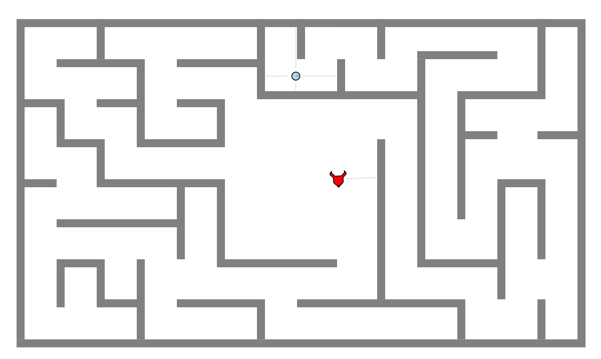

# labyrinth

The goal of this project was to create a fun, engaging, and/or informative simulation or game using the ENVIRO simulator. The Labyrinth project is an adaptation of the Greek Myth of Theseus and the Minotaur. Theseus enters the Labyrinth in search of the monster, and there he must navigate the maze, slay the Minotaur, and escape to safety.

>In Greek mythology, the Labyrinth was constructed to contain the Minotaur, a creature half man, half bull. 
>King Minos would imprison his enemies in the Labyrinth so that the Minotaur could eat them - the Labyrinth was
>so complicated, no one could find their way out alive. Eventually, Theseus, son of King Aegueus, sailed for 
>Crete to kill the Minotaur.

>King Minos knew that even if Theseus did manage to kill the Minotaur, he would never make it out of the 
>Labyrinth. Luckily for the hero, Theseus met Princess Ariadne, who gave him a thread. As he entered the 
>Labyrinth in search of the Minotaur, he unraveled the thread, so that he knew the way out after killing the 
>monster.

## Key Challenges

The key challenges of this project were:
* Motion
* Localization
* Memory - Theseus' string, if you will

## Getting Started

Clone this repository to your machine.

Start the docker container (Note that this project was developed using ENVIRO V1.4)

`docker run -p80:80 -p8765:8765 -v /c/projects/:/source -it klavins/enviro:v1.4 bash`

Navigate to the root of the *labyrinth* repository and compile.

`make`

Start the ENVIRO server

`esm start`

`enviro`

Navigate to http://localhost/ in any web browser.

## How to Play

How to run and/or use the project

## Sources
* [ENVIRO](https://github.com/klavinslab/enviro)
* [Myth of Theseus and the Minotaur](https://www.greekmyths-greekmythology.com/myth-of-theseus-and-minotaur/)

## 
> "The motif of the labyrinth has a long history. Depictions in rock art may date back as far as 10,500-4800 BCE,
> and can be found from Nevada to Cornwall, from Lancashire to Spain. The purpose of the image is unclear, but 
> they all share the same form – a unicursal, meandering symbol, turning and changing directions from outside to
> the centre but never crossing itself. But by far the most famous labyrinth of all is that of ancient Crete"
-[Dr Katy Soar](https://folklorethursday.com/folklore-of-archaeology/cretan-labyrinth-myth-history-archaeology/)

