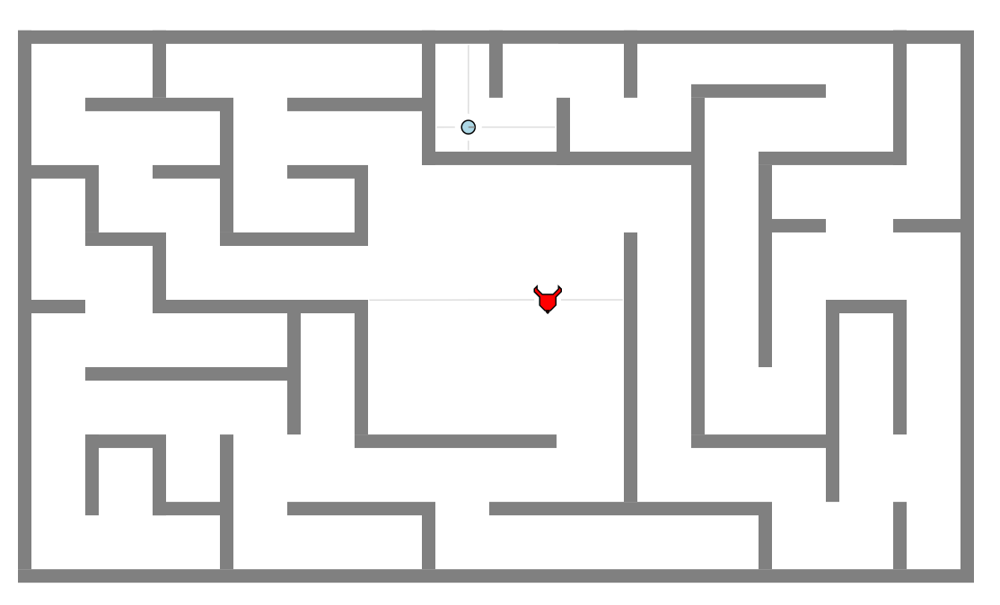

# labyrinth

The goal of this project was to create a fun, engaging, and/or informative simulation or game using the ENVIRO simulator. The Labyrinth project is an adaptation of the Greek myth of Theseus and the Minotaur. Theseus enters the Labyrinth in search of the monster, and there he must navigate the maze, slay the Minotaur, and escape to safety.

>In Greek mythology, the Labyrinth was constructed to contain the Minotaur, a creature half man, half bull. 
>King Minos would imprison his enemies in the Labyrinth so that the Minotaur could eat them - the Labyrinth was
>so complicated, no one could find their way out alive. Eventually, Theseus, son of King Aegueus, sailed for 
>Crete to kill the Minotaur.

>King Minos knew that even if Theseus did manage to kill the Minotaur, he would never make it out of the 
>Labyrinth. Luckily for the hero, Theseus met Princess Ariadne, who gave him a thread. As he entered the 
>Labyrinth in search of the Minotaur, he unraveled the thread, so that he knew the way out after killing the 
>monster.

## Key Challenges

The key challenges of this project were:
* Motion
* Localization
* Memory - *Theseus' string*, if you will

Theseus began as a directional robot. I spent a long time carefully tuning rotation and wall following before turning him into an omnidirectional robot. Now, a State Machine tracks Theseus' cardinal direction, so he can only move North, South, East, or West at any given time. When he reaches a wall or an intersection, he switches to the *Assessing* state and chooses the most open path.

The next challenges, Localization and Memory, tie together. Theseus' goal is to explore the maze in search of the Minotaur, not to "solve" the maze. Thus, he needed a way to track where he had already been. At each intersection, I consolidate the four sensors into a vector, aligned with the four cardinal directions they represent. After eliminating every path blocked by a wall and "the backtrack" path, we choose the most open path by selecting the highest remaining sensor value.

That's Localization, an instantaneous look at where I am now, where I've been, and where I could go next. To form a complete path, each intersection is then committed to memory. That way, when the robot has to backtrack - say, after reaching a dead end - I pop the most recent intersection and re-run the assessment. If there was another valid path, the robot will take it. If not, we will continue to backtrack until a new path presents itself.

The final piece of this challenge is ongoing. The "next step" in this project is to fully flesh out the *backtrack* state to walk through the stored memory and return to the start after Theseus defeats the Minotaur.

## Getting Started

Clone this repository to your machine.

Start the docker container (Note that this project was developed using ENVIRO V1.4)

`docker run -p80:80 -p8765:8765 -v /c/projects/:/source -it klavins/enviro:v1.4 bash`

Navigate to the root of the *labyrinth* repository and compile.

`make`

Start the ENVIRO server

`esm start`

`enviro`

Navigate to http://localhost/ in any web browser.

## How to Play

Theseus will automatically begin searching the Labyrinth for the Minotaur. The search is systematic - if he encounters a dead end, he will backtrack and continue.

When Theseus eventually arrives in the center of the Labyrinth, the chase will commence. Both the Minotaur and Theseus are watching for the other, and they are ready to attack.

### User Input

Clicking the mouse anywhere on the screen will reposition Theseus. This can be fun if you want to explore a different section of the Labyrinth or go straight to the center.

### Game Over

After the Minotaur is defeated, Theseus will begin searching for the way out of the maze.

Note that to regenerate the Minotaur, you must re-run the *enviro* command.

## Sources
* [ENVIRO](https://github.com/klavinslab/enviro)
* [Myth of Theseus and the Minotaur](https://www.greekmyths-greekmythology.com/myth-of-theseus-and-minotaur/)

## 
> "The motif of the labyrinth has a long history. Depictions in rock art may date back as far as 10,500-4800 BCE,
> and can be found from Nevada to Cornwall, from Lancashire to Spain. The purpose of the image is unclear, but 
> they all share the same form – a unicursal, meandering symbol, turning and changing directions from outside to
> the centre but never crossing itself. But by far the most famous labyrinth of all is that of ancient Crete"
-[Dr Katy Soar](https://folklorethursday.com/folklore-of-archaeology/cretan-labyrinth-myth-history-archaeology/)

